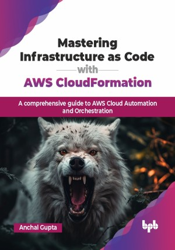

# Mastering Infrastructure as Code with AWS CloudFormation

A comprehensive guide to AWS Cloud Automation and Orchestration.

This is the repository for [Mastering Infrastructure as Code with AWS CloudFormation
](https://bpbonline.com/products/mastering-infrastructure-as-code-with-aws-cloudformation?variant=44312680792264),published by BPB Publications.

## About the Book
In today’s evolving cloud landscape, IaC bridges software development and infrastructure management. AWS CloudFormation, a powerful AWS service, enables you to define, provision, and manage infrastructure through code. This comprehensive guide is your key to unlocking the full potential of AWS CloudFormation, providing the knowledge and skills needed to create, automate, and optimize AWS infrastructures with precision.

Begin your journey with the essentials of AWS CloudFormation and create templates, manage stacks, and navigate the CloudFormation console with confidence. Progress to mastering the design of scalable, secure, and efficient cloud architectures. Explore advanced techniques such as dynamic parameters, reusable templates, and stack dependency management. With practical, real-world examples, you will not only learn the theory but also gain hands-on experience automating deployments, implementing security protocols, and ensuring compliance in your cloud environment.

Upon completing this guide, you will emerge as a proficient AWS CloudFormation expert, capable of crafting and managing AWS infrastructures with code. The future of cloud technology is agile, scalable, and version-controlled, and you will be at the forefront of this transformative shift.

## What You Will Learn
• Automate AWS infrastructure with reusable CloudFormation templates.

• Design scalable, secure cloud infrastructure with best practices.

• Manage stack dependencies and dynamic parameters efficiently.

• Integrate compliance and monitoring into cloud environments using automation.

• Optimize infrastructure deployments, minimizing downtime and manual errors.

• Confidently manage complex AWS infrastructure setups with IaC principles.
